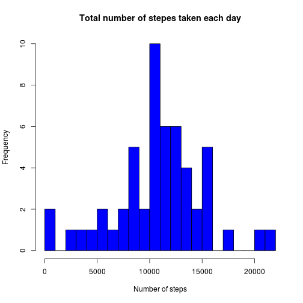
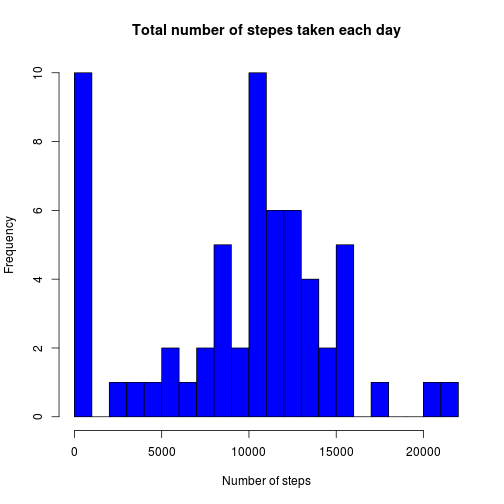

# Reproducible Research: Peer Assessment 1
## Loading and preprocessing the data

```r
data <- read.csv("activity.csv")
data$date <- as.Date(as.character(data$date))
```

## What is mean total number of steps taken per day?

```r
library(plyr)
options( scipen = 20 )

ds <- ddply(data, .(date), summarize, sum=sum(steps))
hist(ds$sum, breaks=25, main = "Total number of stepes taken each day", xlab = "Number of steps", col="blue")
```

 
   
The mean of total number of steps taken per day is __10766.1887__, and the median is __10765__.

## What is the average daily activity pattern?

```r
#data <- data[complete.cases(data),]
df <- ddply(data, .(interval), summarise, steps = mean(steps, na.rm = T))
plot(df, type="l", ylab="Average number of steps taken", xlab = "5 minute interval")
abline(v = df[df$steps == max(df$steps), "interval"], col="blue")
```

 
   
The 5-minute interval that contains the maximum average number of steps is __835__. 
## Imputing missing values
The number of missing values is __2304__.

I will input the missing values of my dataset by making them equal to zero

```r
data[is.na(data$steps), "steps"] <- 0
summary(data)
```

```
##      steps            date               interval   
##  Min.   :  0.0   Min.   :2012-10-01   Min.   :   0  
##  1st Qu.:  0.0   1st Qu.:2012-10-16   1st Qu.: 589  
##  Median :  0.0   Median :2012-10-31   Median :1178  
##  Mean   : 32.5   Mean   :2012-10-31   Mean   :1178  
##  3rd Qu.:  0.0   3rd Qu.:2012-11-15   3rd Qu.:1766  
##  Max.   :806.0   Max.   :2012-11-30   Max.   :2355
```

```r
ds <- ddply(data, .(date), summarize, sum=sum(steps))
hist(ds$sum, breaks=25, main = "Total number of stepes taken each day", xlab = "Number of steps", col="blue")
```

 
   
The mean of total number of steps taken per day after imputing NAs is __9354.2295__, and the median after imputing NAs is __10395__. There is a difference between the the observations made after imputing NAs and the the observations made before imputing NAs. When the original dataset is imputed with zeros, the mean and midian of the dataset is lowered since more data is accounted for while doing these calculations as compared to doing these calculations while eliminating rows with NAs.
## Are there differences in activity patterns between weekdays and weekends?


